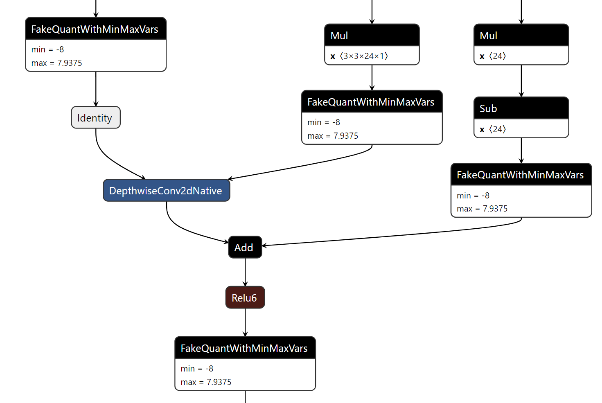
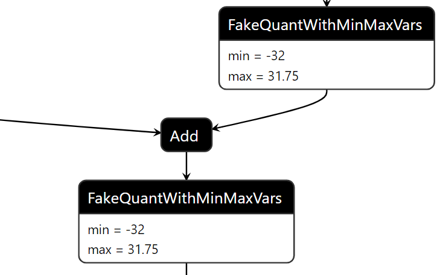

# TF2IR
此Repo实现了由TensorFlow frozen graph向自定义中间表达(Intermediate Representation, IR)转换的工具。该工具读入一个quant-aware-training得到的推理图，将关键层信息提取并储存为json格式，并将参数和测试张量提出并储存为npy格式。

## 1. 项目组成
- `TF2IR.py` 主要转换脚本；
- `models` 存放不同模型；
- `utils` 存放从IR中抽取硬件相关信息的脚本。

## 2. 使用方法
`python TF2IR -i path_to_graph.pb -o output_dir --image_height 160 --image_width 160 --input_tensor_name normalized_input_image_tensor:0 --end_points reshape:0 reshape:1 reshape:2 --test_image test.jpg`
- `-i`: 输入frozen graph路径
- `-o`: 输出路径(应为directory)
- `--image_height`: 图片高度
- `--image_width`: 图片宽度
- `--input_tensor_name`: 推理图中的输入Tensor名称，例如：`input:0`
- `--end_points`: 推理图的结束Tensor名称，例如：对于SSD类检测网络，将各检测头的`Reshape:0`作为结束点，提供给SSD使用。
- `--test_image`: 测试图片路径，用于生成每层的输入输出张量

## 3. 支持的图结构及主要限制
- 目前所有input/w/b/output均为int8格式，采用power-of-2范围的对称量化，即将原tensor取power-of-2范围后，均匀放缩到[-128, 127]范围内。
- 推理图中不能出现Batchnorm单元，所有Batchnorm在训练时都应该Fold进权重。
- CONV/DWCONV在TensorFlow Graph中的结构应为如下格式。其中weight和bias均来源于Fake Quant单元；输出经过Relu6激活或无激活函数；最终输出由Fake Quant单元得到。

- ADD在TensorFlow Graph中的结构应为如下格式。其中x和y来自前序层的输出Fake Quant单元；输出经过Relu6激活或无激活函数；最终输出由Fake Quant单元得到。

- 该工具能够自动识别并跳过图中的Identity单元。
- 在TensorFlow的推理过程中，输入是[-1,1]范围的浮点数；在输出的IR中，第一层的输入log2(scale)信息已被用于移位信息的计算，因此网络的输入应为[-128,127]的整数。


## 4. IR的格式定义
### 4.1. 公用定义
- `previous_layer` 存放前序层的列表，输入张量统一用`input`表示；
- `next_layer` 存放后续层的列表，网络结尾统一用`endpoint`表示；
- 权重及测试张量命名规则为`layername_weight/bias/input/output/add/pl.npy`, 存储格式为：
    - `conv weight`: HWCiCo
    - `dwconv weight`: HWC
    - `bias`: C
    - `feature map`: HWC

### 4.2. 支持的算子及其关键key定义
#### CONV/DWCONV
- `operation`: `conv`代表二维卷积，`dwconv`代表深度可分离卷积
- `activation_type`: 卷积操作内的激活类型，可取值`Relu6`, `None`
- `xx_log2scale`: 该tensor对应的log2(scale), 例如：某input_tensor的实际范围为[-4,4), 使用8bit量化，则对应的`input_log2scale=5`
- `output_shift`: 中间结果->输出的右移位数，`output_shift=input_log2scale+weight_log2scale-output_log2scale`
- `bias_shift`: 加偏置时的偏置左移位数，`bias_shift=input_log2scale+weight_log2scale-bias_log2scale`
- `load_bias`: 取`true`或`false`, 代表该层是否需要加偏置
- `xx_dtype`: 数据类型，目前都应为`int8`

``` json
  {
    "name": "FeatureExtractor_MobilenetV2_Conv_Conv2D_Fold",
    "operation": "conv",
    "activation_type": "Relu6",
    "input_log2scale": 7,
    "weight_log2scale": 4,
    "bias_log2scale": 4,
    "output_log2scale": 4,
    "output_shift": 7,
    "bias_shift": 7,
    "load_bias": true,
    "input_channel_num": 3,
    "output_channel_num": 16,
    "input_size": {
      "height": 160,
      "width": 160
    },
    "padding": {
      "top": 0,
      "bottom": 1,
      "left": 0,
      "right": 1
    },
    "stride": {
      "height": 2,
      "width": 2
    },
    "kernel_size": {
      "height": 3,
      "width": 3
    },
    "output_size": {
      "height": 80,
      "width": 80
    },
    "input_dtype": "int8",
    "output_dtype": "int8",
    "weight_dtype": "int8",
    "bias_dtype": "int8",
    "previous_layer": [
      "input"
    ],
    "next_layer": [
      "FeatureExtractor_MobilenetV2_expanded_conv_depthwise_depthwise_Fold",
      "FeatureExtractor_MobilenetV2_expanded_conv_add"
    ]
  }
```

#### ADD
- `activation_type`: 卷积操作内的激活类型，可取值`Relu6`, `None`
- `pl_xx`: 代表被加数，即TensorFlow图中的op.inputs[0]
- `add_xx`: 代表加数， 即TensorFlow图中的op.inputs[1]
- `output_shift_bit`: 中间累加结果->输出的**左移**位数, `output_shift_bit = output_log2scale - min(add_log2scale, pl_log2scale)`, 负数代表右移。
- `add_shiftbit`和`pl_shiftbit`: 历史遗留命名，含义与`add_log2scale`和`pl_log2scale`相同。
- `dtype`: 数据类型，目前都应为`int8`

``` json
  {
    "name": "FeatureExtractor_MobilenetV2_expanded_conv_add",
    "operation": "add",
    "activation_type": "None",
    "input_channel_num": 16,
    "input_size": {
      "height": 80,
      "width": 80
    },
    "dtype": "int8",
    "pl_log2scale": 4,
    "pl_shiftbit": 4,
    "add_log2scale": 4,
    "add_shiftbit": 4,
    "output_log2scale": 3,
    "output_shift_bit": -1,
    "pl_name": "FeatureExtractor_MobilenetV2_expanded_conv_project_Conv2D_Fold",
    "add_name": "FeatureExtractor_MobilenetV2_Conv_Conv2D_Fold",
    "previous_layer": [
      "FeatureExtractor_MobilenetV2_Conv_Conv2D_Fold",
      "FeatureExtractor_MobilenetV2_expanded_conv_project_Conv2D_Fold"
    ],
    "next_layer": [
      "FeatureExtractor_MobilenetV2_expanded_conv_1_expand_Conv2D_Fold"
    ]
  }
```

#### RESHAPE
- `dtype`: 数据类型，目前都应为`int8`
- `input/output_shape`: 输入/输出shape(不定长)
- `reshape_param`: reshape参数
- `log2scale`: 输入/输出tensor的log2(scale)

``` json
  {
    "name": "BoxPredictor_0_Reshape_1",
    "operation": "reshape",
    "reshape_param": [
      -1,
      2
    ],
    "input_shape": [
      10,
      10,
      6
    ],
    "output_shape": [
      300,
      2
    ],
    "dtype": "int8",
    "log2scale": 2,
    "previous_layer": [
      "BoxPredictor_0_ClassPredictor_Conv2D_Fold"
    ],
    "next_layer": [
      "endpoint"
    ]
  }
```

